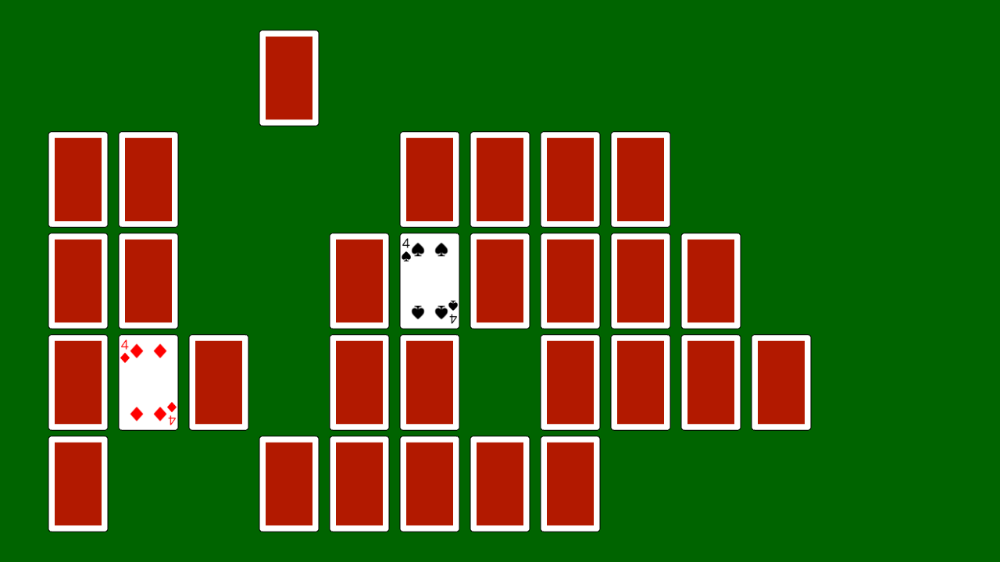

# 神経衰弱



```cpp
# include <Siv3D.hpp> // OpenSiv3D v0.6.3

// i 枚目のトランプをどこに描画するか座標を返す関数
Vec2 IndexToPos(size_t i)
{
	return{ (100.0 + i % 11 * 90), (100.0 + i / 11 * 130) };
}

// 現在の状態をチェックしてカードが 2 枚オモテになっていたら
// 同じ数字の場合: それらのカードをテーブル上に存在しない設定に
// 異なる数字の場合: それらをウラに戻す
// という操作をする関数
void Update(Optional<size_t>& first, Optional<size_t>& second, Array<PlayingCard::Card>& cards, Array<bool>& cardsOntable)
{
	// まだ 2 枚めくっていない場合は何もしない
	if ((not first) || (not second))
	{
		return;
	}

	// 1 枚目にめくったカード
	auto& card1 = cards[*first];

	// 2 枚目にめくったカード
	auto& card2 = cards[*second];

	// カードの数字が一致したら
	if (card1.rank == card2.rank)
	{
		// 2 枚のカードをテーブル上に存在しない設定にする
		cardsOntable[*first] = false;
		cardsOntable[*second] = false;
	}
	else
	{
		// 2 枚のカードをウラ面に戻す
		cards[*first].isFaceSide = false;
		cards[*second].isFaceSide = false;
	}

	// 何もめくっていない状態にする
	first.reset();
	second.reset();
}

void Main()
{
	// ウィンドウを 1280x720 にリサイズする
	Window::Resize(1280, 720);

	// 背景色を設定する
	Scene::SetBackground(Palette::Darkgreen);

	// トランプカードのデータを初期化
	// 引数: カードの幅 75 ピクセル, カードのウラ面の色は暗い赤
	const PlayingCard::Pack pack{ 75, ColorF{ 0.7, 0.1, 0.0 } };

	// 1 セット (52 枚) のトランプを配列で確保
	// 引数: ジョーカー 0 枚, 初期状態はウラ面
	Array<PlayingCard::Card> cards = PlayingCard::CreateDeck(0, false);

	// トランプを無作為にシャッフルする
	cards.shuffle();

	// それぞれのカードがテーブル上に存在するかを記録する配列
	Array<bool> cardsOntable(cards.size(), true);

	// 1 枚目としてめくったカードのインデックス
	Optional<size_t> first;

	// 2 枚目としてめくったカードのインデックス
	Optional<size_t> second;

	// 2 枚目をめくってからの経過時間を計るストップウォッチ
	Stopwatch timeFromSecond;

	while (System::Update())
	{
		////////////////////////////////
		//
		//	状態更新
		//
		////////////////////////////////

		// 2 枚目をめくってから 1 秒以上経過したら
		if (1.0s <= timeFromSecond)
		{
			Update(first, second, cards, cardsOntable);

			// ストップウォッチを初期状態にする
			timeFromSecond.reset();
		}

		// ストップウォッチが動いていなければ
		if (not timeFromSecond.isRunning())
		{
			// 各カードについて、マウスカーソルが重なっていたときの処理
			for (size_t i = 0; i < cards.size(); ++i)
			{
				// カードが存在しない場合はスキップする
				if (not cardsOntable[i])
				{
					continue;
				}

				// すでにオモテを向いているカードはスキップする
				if (cards[i].isFaceSide)
				{
					continue;
				}

				// カードを描画する中心座標
				const Vec2 center = IndexToPos(i);

				// カードの長方形
				const RectF region = pack.regionAt(center);

				// カード上にマウスカーソルがあれば
				if (region.mouseOver())
				{
					// マウスカーソルを手のアイコンにする
					Cursor::RequestStyle(CursorStyle::Hand);

					// 左クリックしたら
					if (MouseL.down())
					{
						if (not first)
						{
							// 1 枚目にめくったカード
							first = i;
						}
						else
						{
							// 2 枚目にめくったカード
							second = i;

							// ストップウォッチを開始する
							timeFromSecond.start();
						}

						// カードをオモテ面にする
						cards[i].isFaceSide = true;
					}

					// これ以上処理するカードは無い
					break;
				}
			}
		}

		////////////////////////////////
		//
		//	描画
		//
		////////////////////////////////

		// 各カードについて
		for (size_t i = 0; i < cards.size(); ++i)
		{
			// もう存在しない場合はスキップする
			if (not cardsOntable[i])
			{
				continue;
			}

			// カードを描画する中心座標
			const Vec2 center = IndexToPos(i);

			// カードを描画する
			pack(cards[i]).drawAt(center);
		}
	}
}
```
