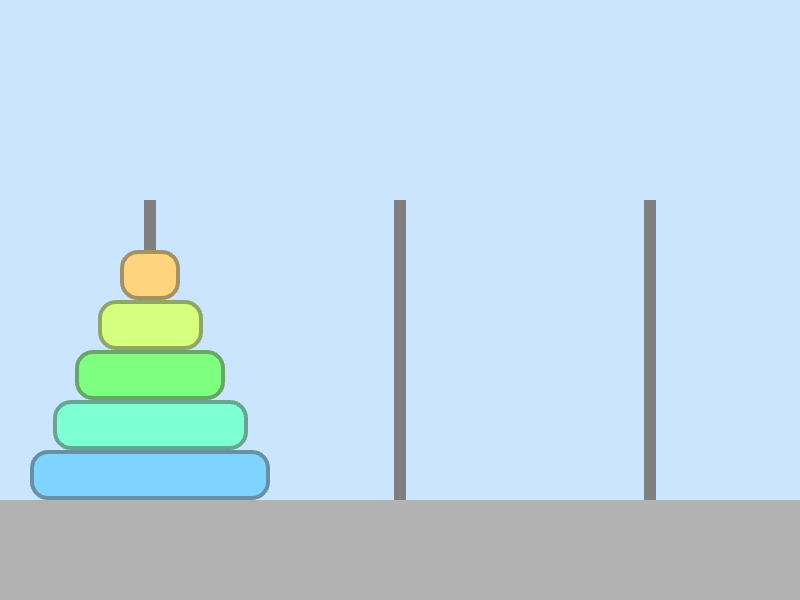

# ハノイの塔



```cpp
# include <Siv3D.hpp> // OpenSiv3D v0.6.3

// 移動元, 移動先情報に基づいて円盤の移動操作を行う
void Update(Optional<size_t>& from, size_t to, std::array<Array<int32>, 3>& towers)
{
	// 移動元情報が無い場合は
	if (not from)
	{
		// 何もしない
		return;
	}

	// 移動元と移動先が同じ
	if (from == to)
	{
		// 移動元選択状態を解除する
		from.reset();
		return;
	}

	// 移動元の塔に円盤が無い場合
	if (not towers[*from])
	{
		// 移動元選択状態を解除する
		from.reset();
		return;
	}

	// 移動させようとしている, 選択中の円盤のサイズ
	const int32 diskSize = towers[*from].back();

	if ((not towers[to]) // 移動先の塔が空であるか
		|| (diskSize < towers[to].back())) // 移動先の塔の一番上（末尾）の円盤よりも小さければ
	{
		// 移動先の塔の一番上（末尾）に追加する
		towers[to] << diskSize;

		// 移動元からは削除する
		towers[*from].pop_back();
	}

	// 移動元選択状態を解除する
	from.reset();
}

void Main()
{
	// 画面のサイズ (800x600)
	constexpr Size SceneSize = Scene::DefaultSceneSize;

	// 地面の色
	constexpr ColorF GroundColor{ 0.7 };

	// 塔の色
	constexpr ColorF TowerColor{ 0.5 };

	// 地面の高さ（ピクセル）
	constexpr int32 GroundHeight = 100;

	// 地面の Y 座標（ピクセル）
	constexpr int32 GroundY = (SceneSize.y - GroundHeight);

	// 各塔の X 座標
	constexpr std::array<int32, 3> TowerXs = { 150, 400, 650 };

	// 各塔の領域（このエリアをクリックすると選択される）
	constexpr std::array<Rect, 3> TowerAreas =
	{
		Rect{ 0, 200, 275, 300 },
		Rect{ 275, 200, 250, 300 },
		Rect{ 525, 200, 275, 300 },
	};

	// 背景色を設定する
	Scene::SetBackground(ColorF{ 0.8, 0.9, 1.0 });

	// 各塔の状態（塔が持つ円盤のサイズを配列で記録）
	std::array<Array<int32>, 3> towers;

	// 最初の塔の円盤の状態（末尾の要素ほど上にある）
	towers[0] = { 5, 4, 3, 2, 1 };

	// 移動元の塔のインデックス（選択中の塔）
	Optional<size_t> from;

	while (System::Update())
	{
		////////////////////////////////
		//
		//	状態更新
		//
		////////////////////////////////

		// 各塔について
		for (size_t i = 0; i < TowerAreas.size(); ++i)
		{
			// 塔の領域上にマウスカーソルがあれば
			if (TowerAreas[i].mouseOver())
			{
				// マウスカーソルを手のアイコンにする
				Cursor::RequestStyle(CursorStyle::Hand);
			}

			// 塔の領域がクリックされたら
			if (TowerAreas[i].leftClicked())
			{
				if (not from) // 選択状態になっている塔が無い場合
				{
					// 現在の塔に円盤があれば
					if (towers[i])
					{
						// 現在の塔を選択状態にする
						from = i;
					}
				}
				else // 選択状態になっている塔がある場合
				{
					Update(from, i, towers);
				}
			}
		}

		////////////////////////////////
		//
		//	描画
		//
		////////////////////////////////

		// 地面を描画する
		Rect{ 0, GroundY, SceneSize.x, GroundHeight }.draw(GroundColor);

		// すべての塔を描画する
		for (const auto& towerX : TowerXs)
		{
			Rect{ Arg::bottomCenter(towerX, GroundY), 12, 300 }.draw(TowerColor);
		}

		// 各塔について
		for (size_t ti = 0; ti < towers.size(); ++ti)
		{
			const auto& tower = towers[ti];

			// 現在の塔が移動元として選択されているか
			const bool selected = (from == ti);

			// それぞれの円盤について
			for (int32 i = 0; i < tower.size(); ++i)
			{
				// 円盤のサイズ
				const int32 diskSize = tower[i];

				// 描画時のサイズ（ピクセル）
				const int32 diskWidth = (15 + diskSize * 45);

				// 描画時の色
				const HSV diskColor{ (diskSize * 40), 0.5, 1.0 };

				// 一番上の円盤であるか
				const bool isTop = (i == (tower.size() - 1));

				Rect{ Arg::bottomCenter(TowerXs[ti], GroundY - i * 50), diskWidth, 50 }
					.moveBy(0, (selected && isTop) ? -50 : 0) // 選択中かつ一番上なら, 本来よりも上に移動させる
					.rounded(18) // 角を丸くする
					.draw(diskColor) // 円盤を描く
					.drawFrame(4, 0, ColorF{ 0.3, 0.5 }); // 円盤の輪郭を描く
			}
		}
	}
}
```
