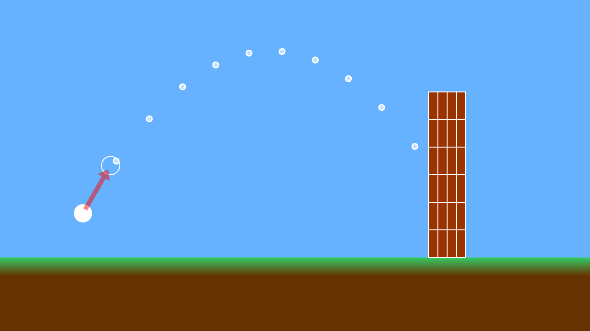

# 2D 物理演算による破壊ゲーム - 予測軌道を描く



```cpp
# include <Siv3D.hpp> // OpenSiv3D v0.6.3

void Main()
{
	// ウィンドウを 1280x720 にリサイズする
	Window::Resize(1280, 720);

	// 背景色を設定する
	Scene::SetBackground(ColorF{ 0.4, 0.7, 1.0 });

	// 2D 物理演算のシミュレーションステップ（秒）
	constexpr double StepSec = (1.0 / 200.0);

	// 2D 物理演算のシミュレーション蓄積時間（秒）
	double accumulatorSec = 0.0;

	// 2D 物理演算のワールド
	P2World world;

	// 地面
	const P2Body ground = world.createRect(P2Static, Vec2{ 0, 100 }, SizeF{ 1600, 200 }, P2Material{ .density = 20.0, .restitution = 0.02, .friction = 0.8 });

	// 箱
	Array<P2Body> boxes;
	{
		for (int32 y = 0; y < 6; ++y) // 縦に
		{
			for (int32 x = 0; x < 4; ++x) // 横に
			{
				boxes << world.createRect(P2Dynamic, Vec2{ (300 + x * 20), (-30 - y * 60) }, SizeF{ 20, 60 },
					P2Material{ .density = 40.0, .restitution = 0.05, .friction = 1.0 })
					.setAwake(false); // 初期状態で安定するよう Sleep させておく
			}
		}
	}

	// ボール
	Array<P2Body> balls;

	// ボールの半径 (cm)
	constexpr double BallRaduis = 20;

	// 発射するボールの初期位置
	constexpr Circle StartCircle{ -400, -200, BallRaduis };

	// ボールをつかんでいるか
	// つかんでいる場合は最初につかんだ座標を格納
	Optional<Vec2> grabbed;

	// 新しく発射できるまでのクールタイム
	constexpr Duration CoolTime = 0.3s;

	// 前回の発射からの経過時間を計るストップウォッチ
	// クールタイム経過済みの状態で開始
	Stopwatch timeSinceShot{ CoolTime, StartImmediately::Yes };

	// 2D カメラ
	// 初期中心座標: (0, 200), 拡大倍率: 1.0, 手動操作なし
	Camera2D camera{ Vec2{ 0, -200 }, 1.0, CameraControl::None_ };

	while (System::Update())
	{
		////////////////////////////////
		//
		//	状態更新
		//
		////////////////////////////////

		// 新しいボールを発射できるか
		const bool readyToLaunch = (CoolTime <= timeSinceShot);

		for (accumulatorSec += Scene::DeltaTime(); StepSec <= accumulatorSec; accumulatorSec -= StepSec)
		{
			// 2D 物理演算のワールドを更新する
			world.update(StepSec);
		}

		// 地面より下に落ちた箱を削除する
		boxes.remove_if([](const P2Body& b) { return (200 < b.getPos().y); });

		// 地面より下に落ちたボールを削除する
		balls.remove_if([](const P2Body& b) { return (200 < b.getPos().y); });

		// 2D カメラを更新する
		camera.update();

		// 2D カメラによる座標変換の適用スコープ
		{
			// 2D カメラから Transformer2D を作成する
			const auto tr = camera.createTransformer();

			// 発射可能で、ボールの初期円を左クリックしたら
			if (readyToLaunch && StartCircle.leftClicked())
			{
				// つかむ
				grabbed = Cursor::PosF();
			}

			// 発射するボールの位置
			Vec2 ballPos = StartCircle.center;

			// 発射するボールの, 初期位置からの移動
			Vec2 ballDelta{ 0,0 };

			if (grabbed)
			{
				ballDelta = (*grabbed - Cursor::PosF())
					.limitLength(150); // 移動量を制限

				ballPos -= ballDelta;
			}

			// つかんでいて, 左クリックを離したら
			if (grabbed && MouseL.up())
			{
				// 円を追加
				balls << world
					.createCircle(P2Dynamic, ballPos, BallRaduis,
						P2Material{ .density = 100.0, .restitution = 0.0, .friction = 1.0 })
					.setVelocity(ballDelta * 8); // 発射速度

				// つかんでいる状態を解除
				grabbed.reset();

				// 発射からの経過時間を 0 から測定
				timeSinceShot.restart();
			}

			////////////////////////////////
			//
			//	描画
			//
			////////////////////////////////

			// 地面を描画する
			{
				// 地面の Quad を得る
				const Quad groundQuad = ground.as<P2Rect>(0)->getQuad();

				// Quad から長方形を復元する
				const RectF groundRect{ groundQuad.p0, (groundQuad.p2 - groundQuad.p0) };

				groundRect
					.draw(ColorF{ 0.4, 0.2, 0.0 }) // 土部分
					.drawFrame(40, 0, ColorF{ 0.2, 0.8, 0.4, 0.0 }, ColorF{ 0.2, 0.8, 0.4 }); // 草部分
			}

			// すべてのボックスを描画する
			for (const auto& box : boxes)
			{
				box.draw(ColorF{ 0.6, 0.2, 0.0 })
					.drawFrame(2); // 輪郭
			}

			// すべてのボールを描画する
			for (const auto& ball : balls)
			{
				ball.draw();
			}

			// ボールを操作できるなら
			if (readyToLaunch && (grabbed || StartCircle.mouseOver()))
			{
				// マウスカーソルを手のアイコンにする
				Cursor::RequestStyle(CursorStyle::Hand);
			}

			// ボールの初期位置を描く
			StartCircle.drawFrame(2);

			// ボールを描く
			if (readyToLaunch)
			{
				Circle{ ballPos, BallRaduis }.draw();
			}

			// ボールを発射する方向の矢印を描く
			if (20.0 < ballDelta.length())
			{
				Line{ ballPos, (ballPos + ballDelta) }
					.stretched(-10)
					.drawArrow(10, { 20, 20 }, ColorF{ 1.0, 0.0, 0.0, 0.5 });
			}

			// ボールの予測軌道を描く
			if (not ballDelta.isZero())
			{
				// 発射速度
				const Vec2 v0 = (ballDelta * 8);

				// 0.15 秒区切りで 10 地点を表示
				for (int32 i = 1; i <= 10; ++i)
				{
					const double t = (i * 0.15);

					// t 秒後の位置（等加速度運動の式）
					const Vec2 pos = ballPos + (v0 * t) + (0.5 * world.getGravity() * t * t);

					// 予測地点を描く
					Circle{ pos, 6 }
						.draw(ColorF{ 1.0, 0.6 })
						.drawFrame(3);
				}
			}
		}
	}
}
```
