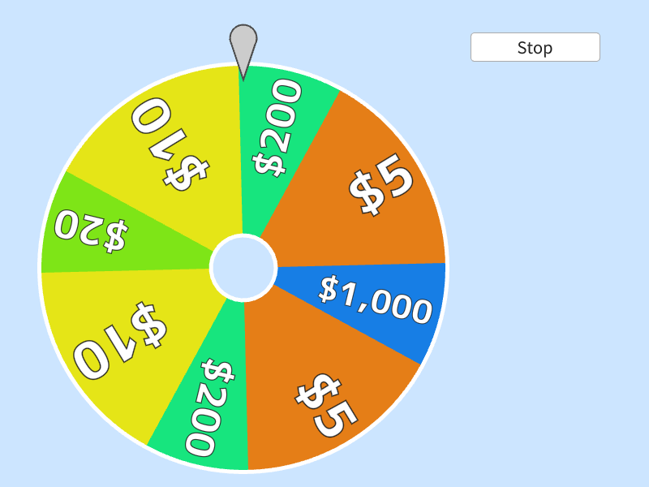

# Wheel of Fortune (ルーレット)



```cpp
# include <Siv3D.hpp> // OpenSiv3D v0.6.3

// ホイールのセグメント
struct Segment
{
	// ラベル
	String text;

	// 開始角度（ラジアン）
	double startAngle;

	// 角度（ラジアン）
	double angle;

	// 色
	ColorF color;

	// フォントの大きさ
	double fontSize;

	// 起こりやすさ（他のセグメントと相対的）
	double p;

	// 境界ぎりぎりでないセグメントの領域を返す（ラジアン）
	std::pair<double, double> getArea(double epsilon) const
	{
		// 境界ぎりぎりにならないような角度の範囲を返す
		return{ (startAngle + epsilon * 10), (startAngle + angle - epsilon * 10) };
	}
};

// ホイールを描画する
void DrawWheel(double angle, const Array<Segment>& segments, const Font& font)
{
	// ホイールを表現する円
	constexpr Circle Wheel{ 300, 330, 250 };

	// 各セグメントを描く
	for (const auto& segment : segments)
	{
		Wheel.drawPie(angle + segment.startAngle, segment.angle, segment.color);

		{
			const Transformer2D tr{ Mat3x2::Rotate(segment.startAngle + segment.angle * 0.5 + angle - 90_deg, Wheel.center) };

			font(segment.text).draw(TextStyle::Outline(0.25, ColorF{ 0.1 }), segment.fontSize, Arg::rightCenter = Wheel.center.movedBy(Wheel.r - 10, 0));
		}
	}

	// ホイールの枠を描く
	Wheel.drawFrame(1, 4);

	// ホイールの中心を描く
	Circle{ Wheel.center, 40 }
		.draw(Scene::GetBackground())
		.drawFrame(5); // 枠を描く

	// 矢印の三角
	constexpr Triangle triangle{ { (Wheel.center.x - 15), (Wheel.center.y - Wheel.r - 30)},
		{ (Wheel.center.x + 15), (Wheel.center.y - Wheel.r - 30)}, { (Wheel.center.x), (Wheel.center.y - Wheel.r + 15)} };

	// 矢印のキャップ
	constexpr Circle circle = Circle{ ((triangle.p0 + triangle.p1) / 2).movedBy(0, -3), 15.5 };

	// 矢印を描く
	triangle.stretched(2).draw(ColorF{ 0.3 });
	circle.stretched(2).draw(ColorF{ 0.3 });
	triangle.draw(ColorF{ 0.8 });
	circle.draw(ColorF{ 0.8 });
}

// 各セグメントの選ばれやすさに基づいて DiscreteDistribution を作成する
DiscreteDistribution MakeDiscreteDistribution(const Array<Segment>& segments)
{
	Array<double> ps;

	for (const auto& segment : segments)
	{
		ps << segment.p;
	}

	return DiscreteDistribution{ ps };
}

void Main()
{
	// 背景色を設定する
	Scene::SetBackground(ColorF{ 0.8, 0.9, 1.0 });

	// フォント
	const Font font{ FontMethod::MSDF, 48, Typeface::Heavy };

	// セグメント一覧
	// セグメントの面積と選ばれる確率は独立して設定可能
	const Array<Segment> segments =
	{
		// 「$10」というセグメント, 0° から始まり, 60° の角度, 黄色, フォントサイズ 64, 選ばれやすさ 1000
		{U"$10", 0_deg, 60_deg, HSV{60, 0.9, 0.9}, 64, 1000},

		// 「$20」というセグメント, 60° から始まり, 30° の角度, 緑色, フォントサイズ 48, 選ばれやすさ 500
		{U"$20", 60_deg, 30_deg, HSV{90, 0.9, 0.9}, 48, 500},

		// 以下同様に設定
		{U"$10", 90_deg, 60_deg, HSV{60, 0.9, 0.9}, 64, 1000},
		{U"$200", 150_deg, 30_deg, HSV{150, 0.9, 0.9}, 48, 50},
		{U"$5", 180_deg, 60_deg, HSV{30, 0.9, 0.9}, 64, 2000},
		{U"$1,000", 240_deg, 30_deg, HSV{210, 0.9, 0.9}, 40, 10},
		{U"$5", 270_deg, 60_deg, HSV{30, 0.9, 0.9}, 64, 2000},
		{U"$200", 330_deg, 30_deg, HSV{150, 0.9, 0.9}, 48, 50},
	};

	// 出現確率分布を計算するクラス
	DiscreteDistribution distribution = MakeDiscreteDistribution(segments);

	// ウォームアップにかかる時間
	constexpr Duration WarmupTime = 1.5s;

	// ウォームアップ中の角加速度（ラジアン/秒）
	constexpr double WarmupAngularAcceleration = 360_deg;

	// 最大の角速度（ラジアン/秒）
	constexpr double MaxAngularVelocity = (WarmupTime.count() * WarmupAngularAcceleration);

	// 回転を停止する角度
	constexpr double Epsilon = 0.1_deg;

	// 角速度（ラジアン/秒）
	double angularVelocity = 0_deg;

	// 現在の回転角度（ラジアン）
	double angle = -255_deg;

	// 最終的な回転角度（ラジアン）
	Optional<double> targetAngle;

	// 回転を開始してからの経過時間
	Stopwatch stopwatch;

	while (System::Update())
	{
		if (not targetAngle) // まだ最終的な回転角度が決まっていない場合
		{
			// 回転を開始してからの経過時間に基づいて角速度を増やす
			angularVelocity = Min((stopwatch.sF() * WarmupAngularAcceleration), MaxAngularVelocity);

			// 現在の角速度に基づいて回転角度を増やす
			angle += (angularVelocity * Scene::DeltaTime());
		}
		else // 最終的な回転角度が決まっている（Stop を押した）場合
		{
			// 最終的な回転角度に向けてスムーズに移動する（角速度も変化）
			angle = Math::SmoothDamp(angle, *targetAngle, angularVelocity, 0.5, MaxAngularVelocity);

			// 最終的な回転角度に近づいたら
			if (AbsDiff(angle, *targetAngle) < Epsilon)
			{
				// 現在の回転角度を最終的な回転角度にする
				angle = *targetAngle;

				// 角速度を 0 にする
				angularVelocity = 0_deg;

				// 最終的な回転角度をリセットする
				targetAngle.reset();

				// ストップウォッチをリセットする
				stopwatch.reset();
			}
		}

		if (stopwatch < WarmupTime) // ウォームアップ時間が経過していない場合
		{
			// 「Start」ボタンを表示
			// stopwatch が開始していない時だけ押せる
			if (SimpleGUI::Button(U"Start", Vec2{ 580, 40 }, 160, (not stopwatch.isRunning())))
			{
				// 回転を開始してからの経過時間を測定開始
				stopwatch.restart();
			}
		}
		else
		{
			// 「Stop」ボタンを表示
			if (SimpleGUI::Button(U"Stop", Vec2{ 580, 40 }, 160, (not targetAngle)))
			{
				// 確率に基づき抽選結果を決定
				const size_t selected = distribution(GetDefaultRNG());

				// 抽選結果に合うセグメントの角度範囲を取得
				const auto [min, max] = segments[selected].getArea(Epsilon);

				// 抽選結果に合う角度をランダムに決定
				const double result = Random(min, max);

				// 抽選結果に合う最終的な回転角度を計算
				// (現在の回転角度) + (360° までの角度) + (抽選結果を指すための回転角度) + (余分な周回 (360° の倍数))
				targetAngle = angle + (360_deg - Fmod(angle, 360_deg)) + (360_deg - result) + (360_deg * 1);

				// デバッグ表示
				//ClearPrint();
				//Print << segments[selected].text;
				//Print << ToDegrees(result);
			}
		}

		// ホイールを描く
		DrawWheel(angle, segments, font);
	}
}
```
