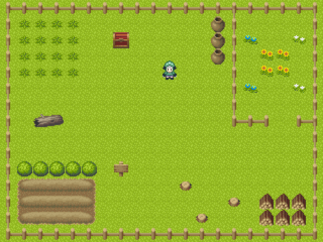

# 2D RPG のマップと移動



必要なファイル
- マップチップファイル: [ぴぽや倉庫](https://pipoya.net/sozai/assets/map-chip_tileset16/) の「320×240用マップチップ・タイル設定データ」をダウンロード
  - ダウンロードした `mapchip2_0724.zip` を展開し、`MapChip` フォルダを `App` フォルダに配置
- `layer0.csv` - 本ページに記載
- `layer1.csv` - 本ページに記載
- `passable.csv` - 本ページに記載

```cpp
# include <Siv3D.hpp> // OpenSiv3D v0.6.3

class MapChip
{
public:

	// マップチップのサイズ（ピクセル）
	static constexpr int32 MapChipSize = 16;

	MapChip()
		: m_base{ U"MapChip/base.png" } {}

	// 指定したインデックスのマップチップを返す
	TextureRegion get(int32 chipIndex) const
	{
		const int32 x = ((chipIndex % 8) * MapChipSize);
		const int32 y = ((chipIndex / 8) * MapChipSize);
		return m_base(x, y, MapChipSize);
	}

private:

	Texture m_base;
};

// CSV ファイルから int32 の二次元配列を読み込む
Grid<int32> LoadCSV(FilePathView path)
{
	// CSC ファイルを読み込む
	CSV csv{ path };

	// 読み込みに失敗したら
	if (not csv)
	{
		// エラー
		throw Error{ U"Failed to load `{}`"_fmt(path)};
	}

	// 行数
	const size_t yCount = csv.rows();

	// 1 行目の列数（以降も同じ列数と仮定する）
	const size_t xCount = csv.columns(0);

	// 二次元配列
	Grid<int32> map(xCount, yCount);

	for (size_t y = 0; y < yCount; ++y)
	{
		for (size_t x = 0; x < xCount; ++x)
		{
			// 指定した行・列の値を読み込む
			map[y][x] = csv.get<int32>(y, x);
		}
	}

	return map;
}

void Main()
{
	// ウィンドウを 640x480 にリサイズする
	Window::Resize(640, 480);

	// マップチップ用テクスチャ
	MapChip mapchip;

	// マップのセルの数（横 20, 縦 15 マス）
	constexpr Size MapSize{ 20, 15 };

	// 最下層のマップチップの二次元配列
	Grid<int32> mapLayer0 = LoadCSV(U"layer0.csv");

	// 1 段上のマップチップの二次元配列
	Grid<int32> mapLayer1 = LoadCSV(U"layer1.csv");

	// 通行可能判定用の二次元配列
	Grid<int32> mapPassable = LoadCSV(U"passable.csv");

	if ((mapLayer0.size() != MapSize)
		|| (mapLayer1.size() != MapSize)
		|| (mapPassable.size() != MapSize))
	{
		// MapSize と、ロードしたデータのサイズが一致しない場合のエラー
		throw Error{ U"mapLayer0: {}, mapLayer1: {}, mapPassable: {}"_fmt(mapLayer0.size(), mapLayer1.size(), mapPassable.size()) };
	}

	// ドット絵 Siv3D くんの歩行アニメーションテクスチャ
	const Texture siv3dKunTexture{ U"example/spritesheet/siv3d-kun-16.png" };

	// 現在のセル座標
	Point currentCell{ 6, 6 };

	// 移動先のセル座標
	Point nextCell = currentCell;

	// 歩行の速さ (マス/秒)
	constexpr double walkSpeed = 2.5;

	// 歩行の進捗 (移動開始: 0.0, nextCell に到達: 1.0)
	double walkProgress = 1.0;

	// 方向: (下: 0, 左: 1, 右: 2, 上: 3) 
	int32 direction = 0;

	// マップ描画用のレンダーテクスチャ
	// マップを 320x240 のレンダーテクスチャに描画し、それを最終的に 2 倍サイズで描画する
	RenderTexture renderTexture{ 320, 240 };

	while (System::Update())
	{
		////////////////////////////////
		//
		//	状態更新
		//
		////////////////////////////////

		// レンダーテクスチャを黒でクリア
		renderTexture.clear(ColorF{ 0.0,1.0 });

		// 現在移動中でない場合、上下左右キーで次に進むセルを変更
		if (currentCell == nextCell)
		{
			//
			// 移動先のセル座標を設定
			//
			if (KeyDown.pressed()) // ↓ キー
			{
				++nextCell.y;
				direction = 0;
			}
			else if (KeyUp.pressed()) // ↑ キー
			{
				--nextCell.y;
				direction = 3;
			}
			else if (KeyLeft.pressed()) // ← キー
			{
				--nextCell.x;
				direction = 1;
			}
			else if (KeyRight.pressed()) // → キー
			{
				++nextCell.x;
				direction = 2;
			}

			// nextCell をマップの範囲内に収める
			nextCell.x = Clamp(nextCell.x, 0, (MapSize.x - 1));
			nextCell.y = Clamp(nextCell.y, 0, (MapSize.y - 1));

			// 移動先のセルが通行不能な場合
			if (mapPassable[nextCell] == 1)
			{
				// nextCell を現在のセル座標にする
				nextCell = currentCell;
			}

			// 移動が発生する場合
			if (currentCell != nextCell)
			{
				// 歩行の進捗を戻す
				walkProgress -= 1.0;
			}
			else
			{
				// 移動しない場合、歩行の進捗は 1.0
				walkProgress = 1.0;
			}
		}

		// 移動中の場合
		if (currentCell != nextCell)
		{
			// 歩行の進捗を進める
			walkProgress += (Scene::DeltaTime() * walkSpeed);

			// 歩行の進捗が 1.0 以上になったら
			if (1.0 <= walkProgress)
			{
				// 現在のセルを nextCell にして移動完了
				currentCell = nextCell;
			}
		}

		////////////////////////////////
		//
		//	描画
		//
		////////////////////////////////

		{
			// renderTexture を描画先として設定
			const ScopedRenderTarget2D rt{ renderTexture };

			// スペースキーを押すと通行可能判定を可視化する
			const bool showPassable = KeySpace.pressed();

			// マップ
			for (int32 y = 0; y < MapSize.y; ++y)
			{
				for (int32 x = 0; x < MapSize.x; ++x)
				{
					// マップチップの描画座標
					const Point pos{ (x * MapChip::MapChipSize), (y * MapChip::MapChipSize) };

					// 最下層のマップチップ
					if (const int32 chipIndex = mapLayer0[y][x];
						chipIndex != 0)
					{
						mapchip.get(chipIndex).draw(pos);
					}

					// 1 段上のマップチップ
					if (const int32 chipIndex = mapLayer1[y][x];
						chipIndex != 0)
					{
						mapchip.get(chipIndex).draw(pos);
					}

					// 通行可能判定
					if (showPassable
						&& (mapPassable[y][x] != 0)) // 通行不能な場合
					{
						// 半透明な正方形を描く
						Rect{ pos, MapChip::MapChipSize }.draw(ColorF{ 0, 0, 1.0, 0.4 });

						// × マークを表示する
						Shape2D::Cross((MapChip::MapChipSize * 0.3), 3, Vec2{ (MapChip::MapChipSize * (x + 0.5)), (MapChip::MapChipSize * (y + 0.5)) })
							.draw(Palette::Red);
					}
				}
			}

			// Siv3D くん
			{
				// 歩行の進捗に基づいて、現在のセル座標を小数で計算
				const Vec2 cellPos = currentCell.lerp(nextCell, walkProgress);

				// 現在のセル座標を描画座標に変換
				const Vec2 pos = (cellPos * MapChip::MapChipSize) + Vec2{ -2, -12 };

				// 歩行のアニメーションのインデックス (0, 1, 2)
				int32 animationIndex = 1;

				// 歩行の進捗が 0.25～0.75 の間は歩行中の絵にする
				if (InRange(walkProgress, 0.25, 0.75))
				{
					// (nextCell.x + nextCell.y) が偶数なら 0, 奇数なら 2
					animationIndex = IsEven(nextCell.x + nextCell.y) ? 0 : 2;
				}

				// Siv3D くんを描画する
				siv3dKunTexture((20 * animationIndex), (28 * direction), 20, 28).draw(pos);
			}
		}

		{
			// テクスチャ拡大描画時にフィルタリング（なめらかなな拡大処理）をしないサンプラーステートを適用
			const ScopedRenderStates2D sampler{ SamplerState::ClampNearest };

			// renderTexture を 2 倍のサイズでシーンに描画
			renderTexture.scaled(2).draw();
		}
	}
}

```

---

`layer0.csv`
```
32,32,32,32,32,32,32,32,32,32,32,32,32,32,32,32,32,32,32,32
32,32,32,32,32,32,32,32,32,32,32,32,32,32,32,32,32,32,32,32
32,32,32,32,32,32,32,32,32,32,32,32,32,32,32,32,32,32,32,32
32,32,32,32,32,32,32,32,32,32,32,32,32,32,32,32,32,32,32,32
32,32,32,32,32,32,32,32,32,32,32,32,32,32,32,32,32,32,32,32
32,32,32,32,32,32,32,32,32,32,32,32,32,32,32,32,32,32,32,32
32,32,32,32,32,32,32,32,32,32,32,32,32,32,32,32,32,32,32,32
32,32,32,32,32,32,32,32,32,32,32,32,32,32,32,32,32,32,32,32
32,32,32,32,32,32,32,32,32,32,32,32,32,32,32,32,32,32,32,32
32,32,32,32,32,32,32,32,32,32,32,32,32,32,32,32,32,32,32,32
32,32,32,32,32,32,32,32,32,32,32,32,32,32,32,32,32,32,32,32
32,32,32,32,32,32,32,32,32,32,32,32,32,32,32,32,32,32,32,32
32,32,32,32,32,32,32,32,32,32,32,32,32,32,32,32,32,32,32,32
32,32,32,32,32,32,32,32,32,32,32,32,32,32,32,32,32,32,32,32
32,32,32,32,32,32,32,32,32,32,32,32,32,32,32,32,32,32,32,32
```

---

`layer1.csv`
```
242,248,248,248,248,248,248,248,248,248,248,248,248,248,246,248,248,248,248,243
240,88,88,88,88,0,0,0,0,0,0,0,0,985,240,0,0,0,0,240
240,88,88,88,88,0,0,990,0,0,0,0,0,985,240,94,0,0,92,240
240,88,88,88,88,0,0,0,0,0,0,0,0,985,240,0,95,95,0,240
240,88,88,88,88,0,0,0,0,0,0,0,0,0,240,0,95,95,0,240
240,0,0,0,0,0,0,0,0,0,0,0,0,0,240,94,0,0,92,240
240,0,0,0,0,0,0,0,0,0,0,0,0,0,240,0,0,0,0,240
240,0,86,87,0,0,0,0,0,0,0,0,0,0,250,248,244,0,252,254
240,0,0,0,0,0,0,0,0,0,0,0,0,0,0,0,0,0,0,240
240,0,0,0,0,0,0,0,0,0,0,0,0,0,0,0,0,0,0,240
240,80,80,80,80,80,0,307,0,0,0,0,0,0,0,0,0,0,0,240
240,208,209,209,209,210,0,0,0,0,0,85,0,0,0,0,0,0,0,240
240,216,217,217,217,218,0,0,0,0,0,0,0,0,85,0,994,994,994,240
240,224,225,225,225,226,0,0,0,0,0,0,85,0,0,0,994,994,994,240
250,248,248,248,248,248,248,248,248,248,248,248,248,248,248,248,248,248,248,251
```

---

`passable.csv`
```
1,1,1,1,1,1,1,1,1,1,1,1,1,1,1,1,1,1,1,1
1,0,0,0,0,0,0,0,0,0,0,0,0,1,1,0,0,0,0,1
1,0,0,0,0,0,0,1,0,0,0,0,0,1,1,0,0,0,0,1
1,0,0,0,0,0,0,0,0,0,0,0,0,1,1,0,0,0,0,1
1,0,0,0,0,0,0,0,0,0,0,0,0,0,1,0,0,0,0,1
1,0,0,0,0,0,0,0,0,0,0,0,0,0,1,0,0,0,0,1
1,0,0,0,0,0,0,0,0,0,0,0,0,0,1,0,0,0,0,1
1,0,1,1,0,0,0,0,0,0,0,0,0,0,1,1,1,0,1,1
1,0,0,0,0,0,0,0,0,0,0,0,0,0,0,0,0,0,0,1
1,0,0,0,0,0,0,0,0,0,0,0,0,0,0,0,0,0,0,1
1,1,1,1,1,1,0,1,0,0,0,0,0,0,0,0,0,0,0,1
1,0,0,0,0,0,0,0,0,0,0,1,0,0,0,0,0,0,0,1
1,0,0,0,0,0,0,0,0,0,0,0,0,0,1,0,1,1,1,1
1,0,0,0,0,0,0,0,0,0,0,0,1,0,0,0,1,1,1,1
1,1,1,1,1,1,1,1,1,1,1,1,1,1,1,1,1,1,1,1
```
