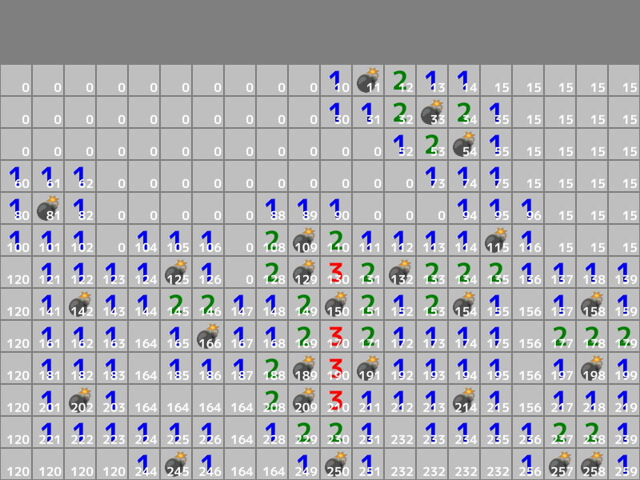

# マインスイーパーの島構造の構築



```cpp
# include <Siv3D.hpp> // OpenSiv3D v0.6.4

// セルの状態
struct CellState
{
	// 島番号（数字のないマスを一気に開くときに使う）
	int32 groupIndex = 0;
};

// 周囲のマスへのオフセット
constexpr Point Offsets[8] =
{
	{ -1, -1 }, { 0, -1 }, { 1, -1 },
	{ -1,  0 }           , { 1,  0 },
	{ -1,  1 }, { 0,  1 }, { 1,  1 },
};

// 指定したマス目の周囲にある 💣 (-1) の個数を返す関数
int32 GetBombCount(const Grid<int32>& grid, const Point& center)
{
	// 自身が 💣 (-1) なら -1 を返す
	if (grid[center] == -1)
	{
		return -1;
	}

	// 見つかった 💣 (-1) の個数
	int32 bombCount = 0;

	for (const auto& offset : Offsets)
	{
		// 調べるマス
		const Point pos = (center + offset);

		// grid.fetch(pos, defaultValue) は、
		// pos が範囲内の場合 grid[pos] を返し、それ以外の場合は defaultValue を返す
		if (grid.fetch(pos, 0) == -1) // 💣 (-1) の場合
		{
			++bombCount;
		}
	}

	return bombCount;
}

// 盤面を生成する関数
Grid<int32> MakeGame(const Size& size, int32 bombs)
{
	// 盤面の二次元配列を作成する
	Grid<int32> grid(size);

	// 指定された個数だけ 💣 (-1) を設置する
	while (bombs)
	{
		// 二次元配列上のランダムな位置
		const Point pos = RandomPoint((size.x - 1), (size.y - 1));

		// 未設置であれば
		if (grid[pos] == 0)
		{
			// 💣 (-1) を設置する
			grid[pos] = -1;

			// 残りの 💣 の個数を減らす
			--bombs;
		}
	}

	// すべてのマスについて
	for (int32 y = 0; y < size.y; ++y)
	{
		for (int32 x = 0; x < size.x; ++x)
		{
			// 数字を計算する。ただし、💣 マスは -1 のまま
			grid[y][x] = GetBombCount(grid, Point{ x, y });
		}
	}

	return grid;
}

// 盤面の状態を作成する関数
Grid<CellState> MakeStates(const Grid<int32>& grid)
{
	const Size size = grid.size();

	// 盤面と同じ大きさの二次元配列
	Grid<CellState> states(size);

	// 各マスの接続状況を管理するデータ構造
	DisjointSet<int32> ds{ states.num_elements() };

	// すべてのマスについて
	for (int32 y = 0; y < size.y; ++y)
	{
		for (int32 x = 0; x < size.x; ++x)
		{
			// 自身のマスのインデックス
			const int32 index = static_cast<int32>(y * size.x + x);

			// 自身が 0 のマスで
			if (grid[y][x] == 0)
			{
				// 右のマスが 0 なら
				if (int nx = (x + 1);
					(nx < size.x) && (grid[y][nx] == 0))
				{
					const int32 east = (index + 1); // 右のマスのインデックス
					ds.merge(index, east); // 右のマスを同じ島にする
				}

				// 下のマスが 0 なら
				if (int ny = (y + 1);
					(ny < size.y) && (grid[ny][x] == 0))
				{
					const int32 south = (index + size.x); // 下のマスのインデックス
					ds.merge(index, south); // 下のマスを同じ島にする
				}
			}
		}
	}

	{
		// マスのインデックス
		int32 index = 0;

		// すべてのマスについて
		for (int32 y = 0; y < size.y; ++y)
		{
			for (int32 x = 0; x < size.x; ++x)
			{
				// 島番号を割り当て
				states[y][x].groupIndex = ds.find(index);

				++index;
			}
		}
	}

	return states;
}

// 盤面を描画する関数
void DrawGame(const Grid<int32>& grid, const Grid<CellState>& states, const Font& font, const Texture& bombTexture, const Point& gamePos, const Size& cellSize)
{
	// 0～8 の数字の色
	constexpr ColorF NumberColors[8] =
	{
		ColorF{ 0, 0, 0 }, ColorF{ 0, 0, 1 }, ColorF{ 0, 0.5, 0 }, ColorF{ 1, 0, 0 },
		ColorF{ 0, 0, 0.5 }, ColorF{ 0.5, 0, 0 }, ColorF{ 0.5, 0, 0 }, ColorF{ 0.5, 0, 0 }
	};

	// すべてのマスについて
	for (int32 y = 0; y < grid.height(); ++y)
	{
		for (int32 x = 0; x < grid.width(); ++x)
		{
			// セルの左上座標
			const Point pos = (gamePos + (cellSize * Point{ x, y }));

			// セルの領域
			const Rect cell{ pos, cellSize };
			{
				// 背景を描く
				cell.stretched(-1).draw(ColorF{ 0.75 });

				if (const int32 n = grid[y][x];
					n == -1) // 💣 (-1) マスであれば
				{
					// 爆弾を描く
					bombTexture.resized(36).drawAt(cell.center());
				}
				else if (1 <= n) // 1 以上の数字マスであれば
				{
					// 数字を描く
					font(n).drawAt(cell.center(), NumberColors[n]);
				}

				// 島番号をデバッグ表示
				font(states[y][x].groupIndex).draw(15, Arg::bottomRight = cell.br().movedBy(-3, 0));
			}
		}
	}
}

void Main()
{
	// 背景色をやや暗い灰色にする
	Scene::SetBackground(ColorF{ 0.5 });

	// 盤面のマス目の数
	constexpr Size GameSize{ 20, 13 };

	// 設置する 💣 の個数
	constexpr int32 BombCount = 24;

	// 💣 の個数がマス目の 4 分の 1 以上の場合はコンパイルエラーにする
	static_assert(BombCount < (GameSize.area() / 4));

	// セルの大きさ
	constexpr Size CellSize{ 40, 40 };

	// 盤面の描画位置
	constexpr Size GamePos{ 0, 80 };

	// 数字用のフォント
	const Font font{ FontMethod::MSDF, 32, Typeface::Bold };

	// 爆弾の絵文字
	const Texture bombTexture{ U"💣"_emoji };

	// 盤面を作成する
	Grid<int32> grid = MakeGame(GameSize, BombCount);

	// 各セルの状態を作成する
	Grid<CellState> states = MakeStates(grid);

	while (System::Update())
	{
		////////////////////////////////
		//
		//	描画
		//
		////////////////////////////////
		{
			// 盤面を描く
			DrawGame(grid, states, font, bombTexture, GamePos, CellSize);
		}
	}
}
```
