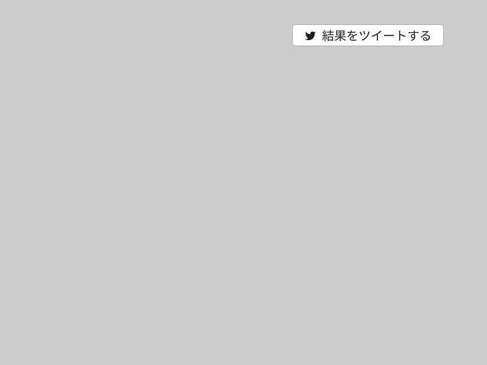

# 結果をツイートするボタン



```cpp
# include <Siv3D.hpp> // OpenSiv3D v0.6.4

void Main()
{
	Scene::SetBackground(ColorF{ 0.8 });

	while (System::Update())
	{
		////////////////////////////////
		//
		// 結果をツイートするボタン
		//
		if (SimpleGUI::Button(U"\U000F0544  結果をツイートする", Vec2{ 480, 40 }))
		{
			const int32 score = 12345;
			const String hashTag = U"#my_game";
			const URL url = U"https://www.google.com/";
			const String tweet = U"ゲームで {} 点を獲得しました！\n{}\n{}"_fmt(score, hashTag, url);
			Twitter::OpenTweetWindow(tweet);
		}
		//
		////////////////////////////////
	}
}
```
